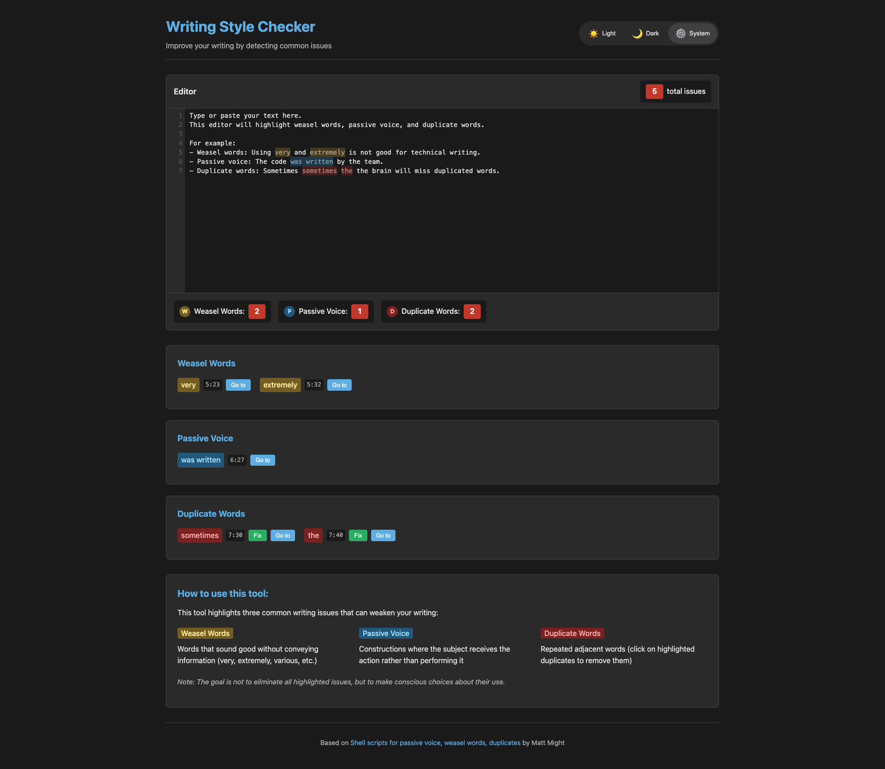

# Writing Style Checker

[](https://github.com/theserverlessdev/wsc/actions/workflows/ci.yml)
[](https://www.npmjs.com/package/wsc-mcp)
[](LICENSE)

A tool that detects common writing issues: **weasel words**, **passive voice**, **duplicate words**, **long sentences**, **nominalizations**, **hedging language**, **filler adverbs**, and **AI tells**. Available as a web editor, HTTP API, MCP server, CLI tool, and GitHub Action.

**[Live: wsc.theserverless.dev](https://wsc.theserverless.dev)**



## Features

- **Web Editor** - Real-time highlighting with inline fix buttons for all 8 detectors
- **HTTP API** - POST text with optional config, get structured JSON results
- **MCP Server (Remote)** - Connect AI assistants via Streamable HTTP transport
- **MCP Server (Local)** - Stdio-based server via [`wsc-mcp`](https://www.npmjs.com/package/wsc-mcp) on npm
- **CLI** - Check files from the command line via `wsc-cli`
- **GitHub Action** - Run checks in CI with `::warning` annotations
- **Configurable** - Customize detectors with `.wscrc.json` files

---

## Detection Rules

| Detector | Items | Description |
|----------|-------|-------------|
| **Weasel Words** | 95 words/phrases | Vague terms like "very", "basically", "arguably", "numerous" |
| **Passive Voice** | 262 irregular verbs | Auxiliary verbs + past participles (regular `-ed` + irregular) |
| **Duplicate Words** | — | Adjacent repeated words across whitespace, case-insensitive |
| **Long Sentences** | threshold: 30 words | Sentences exceeding a configurable word count |
| **Nominalizations** | 230 word pairs | Nouns replaceable with verbs ("utilization" → "use") |
| **Hedging** | 100 phrases | Phrases that weaken assertions ("I think", "it seems") |
| **Filler Adverbs** | 140 words | Adverbs adding emphasis without substance ("totally", "utterly") |
| **AI Tells** | 37 words + 31 phrases | Words/phrases overrepresented in AI-generated text ("delve", "tapestry", "let's dive in") |

Word lists sourced from [Matt Might's shell scripts](https://matt.might.net/articles/shell-scripts-for-passive-voice-weasel-words-duplicates/) and expanded with additional entries. AI tells based on GPTZero corpus analysis and CMU PNAS study.

---

## Configuration

Create a `.wscrc.json` to customize detectors. All tools (API, MCP, CLI) support it.

```json
{
  "$schema": "https://wsc.theserverless.dev/schema.json",
  "detectors": {
    "weaselWords": {
      "enabled": true,
      "add": ["synergy", "leverage"],
      "remove": ["very"]
    },
    "longSentences": { "maxWords": 25 },
    "adverbs": { "enabled": false }
  }
}
```

Every field is optional. Missing fields use defaults. JSON Schema provides autocompletion in VS Code.

---

## API Usage

### `POST /api/check`

Analyze text for writing style issues. Accepts optional `config` object.

```bash
curl -X POST https://wsc.theserverless.dev/api/check \
  -H "Content-Type: application/json" \
  -d '{"text":"The code was written very quickly."}'
```

**Response:**

```json
{
  "summary": {
    "total": 2,
    "weaselWords": 1,
    "passiveVoice": 1,
    "duplicateWords": 0,
    "longSentences": 0,
    "nominalizations": 0,
    "hedging": 0,
    "adverbs": 0
  },
  "issues": {
    "weaselWords": [{ "word": "very", "index": 21, "line": 1, "column": 22, "context": "..." }],
    "passiveVoice": [{ "phrase": "was written", "index": 9, "line": 1, "column": 10, "context": "..." }],
    "duplicateWords": [],
    "longSentences": [],
    "nominalizations": [],
    "hedging": [],
    "adverbs": []
  },
  "meta": { "characterCount": 34, "wordCount": 6, "sentenceCount": 1, "processingTimeMs": 2 }
}
```

**With config:**

```bash
curl -X POST https://wsc.theserverless.dev/api/check \
  -H "Content-Type: application/json" \
  -d '{"text":"The code was written very quickly.", "config":{"detectors":{"weaselWords":{"enabled":false}}}}'
```

### `GET /api/check`

Returns API documentation as JSON.

### `GET /api/detectors`

Returns the list of all 8 detectors with descriptions, configurability, and word counts.

### `GET /health`

Runs a smoke test with known text and returns `{"status":"healthy"}` or `503`.

**Limits:** Max 100,000 characters per request. CORS enabled for all origins.

---

## MCP Server

The Writing Style Checker is available as an [MCP](https://modelcontextprotocol.io/) server, letting AI assistants check your writing directly.

### Tools

| Tool | Description |
|------|-------------|
| `check_text` | Analyze text for all 8 writing style issues. Accepts optional `config`. |
| `fix_duplicates` | Remove duplicate adjacent words and return cleaned text |
| `list_weasel_words` | Return the complete list of weasel words the checker flags |
| `list_word_lists` | Return info about all detector word lists |
| `check_file` | *(Local only)* Read a file from disk and analyze it. Auto-discovers `.wscrc.json`. |

### Remote MCP Server

Connect any MCP client to the hosted server - no installation required.

```json
{
  "mcpServers": {
    "writing-style-checker": {
      "type": "url",
      "url": "https://wsc.theserverless.dev/mcp"
    }
  }
}
```

### Local MCP Server (stdio)

Install via npm for local usage. Includes `check_file` for analyzing files on disk with auto-discovery of `.wscrc.json`.

```bash
npx wsc-mcp
```

**Claude Desktop / Claude Code config:**

```json
{
  "mcpServers": {
    "writing-style-checker": {
      "command": "npx",
      "args": ["wsc-mcp"]
    }
  }
}
```

See the [`wsc-mcp` npm page](https://www.npmjs.com/package/wsc-mcp) for full documentation.

---

## CLI

Check files from the command line.

```bash
# Check all markdown files
npx wsc-cli check "**/*.md"

# Read from stdin
echo "The code was written very quickly." | npx wsc-cli check --stdin

# JSON output for scripting
npx wsc-cli check "**/*.md" --format json

# GitHub Actions annotations
npx wsc-cli check "**/*.md" --format github

# Create a config file
npx wsc-cli init
```

See the [`wsc-cli` README](cli/README.md) for full documentation.

---

## GitHub Action

```yaml
- uses: theserverlessdev/wsc@master
  with:
    files: '**/*.md'
    max-warnings: 20
```

| Input | Default | Description |
|-------|---------|-------------|
| `files` | `**/*.md` | Glob pattern for files to check |
| `config` | — | Path to `.wscrc.json` config file |
| `max-warnings` | unlimited | Max warnings before failing |
| `only-changed` | `false` | Only check files changed in this PR |

---

## Privacy

The web editor runs **entirely in your browser** - text is never sent to any server. The API and MCP endpoints only process text you explicitly send to them.

---

## Project Structure

```
.
├── src/
│   ├── core/                    # Shared detection engine
│   │   ├── detector.ts          # 8 detection algorithms
│   │   ├── words.ts             # Word/phrase lists (800+ entries)
│   │   ├── config.ts            # Config types, merging, validation
│   │   ├── config-node.ts       # Node-only: file loading, discovery
│   │   ├── analyzer.ts          # Unified analyzeText() entry point
│   │   └── index.ts             # Public API exports
│   ├── docs/                    # Documentation content (Markdown files)
│   ├── mcp/
│   │   └── handler.ts           # MCP JSON-RPC 2.0 handler
│   ├── lib/
│   │   ├── App.svelte           # Main editor page component
│   │   ├── stores/theme.ts      # Theme store (light/dark/system)
│   │   └── components/          # UI components (StatsBar, ConfigPanel, etc.)
│   ├── routes/
│   │   ├── +layout.svelte       # Shared layout (header, nav, footer)
│   │   ├── api/check/+server.ts # HTTP API endpoint
│   │   ├── mcp/+server.ts       # MCP endpoint
│   │   ├── health/+server.ts    # Health check endpoint
│   │   ├── docs/+page.svelte    # Documentation page
│   │   └── words/+page.svelte   # Word library browser
│   └── styles/
│       └── main.scss            # Global styles (light + dark themes)
├── mcp-server/                  # Standalone stdio MCP server (npm: wsc-mcp)
├── cli/                         # CLI tool (npm: wsc-cli)
├── action/                      # GitHub Action (composite)
├── tests/                       # 341 tests across 18 files
├── static/
│   ├── schema.json              # JSON Schema for .wscrc.json
│   ├── llms.txt                 # AI/LLM discovery file
│   └── llms-full.txt            # Detailed LLM context
├── wrangler.toml                # Cloudflare Workers config
└── svelte.config.js             # SvelteKit configuration
```

---

## Local Development

```bash
git clone https://github.com/theserverlessdev/wsc.git
cd wsc
npm install
npm run dev
```

Visit `http://localhost:5173`. The API is at `/api/check`, MCP at `/mcp`, health at `/health`.

### Commands

| Command | Description |
|---------|-------------|
| `npm run dev` | Start dev server |
| `npm run build` | Build for production |
| `npm run check` | Type check with svelte-check |
| `npm test` | Run all 341 tests |
| `npm run test:coverage` | Coverage report |

## Deployment

Deployed as a Cloudflare Worker at `wsc.theserverless.dev`.

```bash
npm run build
npx wrangler deploy
```

---

## Contributing

See [CONTRIBUTING.md](CONTRIBUTING.md) for development setup, testing, and pull request guidelines.

For substantial changes, please [open an issue](https://github.com/theserverlessdev/wsc/issues) first.

## Acknowledgements

- [Matt Might](https://matt.might.net/) for the [original shell scripts](https://matt.might.net/articles/shell-scripts-for-passive-voice-weasel-words-duplicates/)
- Built with [SvelteKit](https://svelte.dev/) and [Svelte 5](https://svelte.dev/blog/svelte-5-is-alive), deployed on [Cloudflare Workers](https://workers.cloudflare.com/)
- Logo made with [DiffusionBee](https://diffusionbee.com/)

## License

[MIT](LICENSE)
