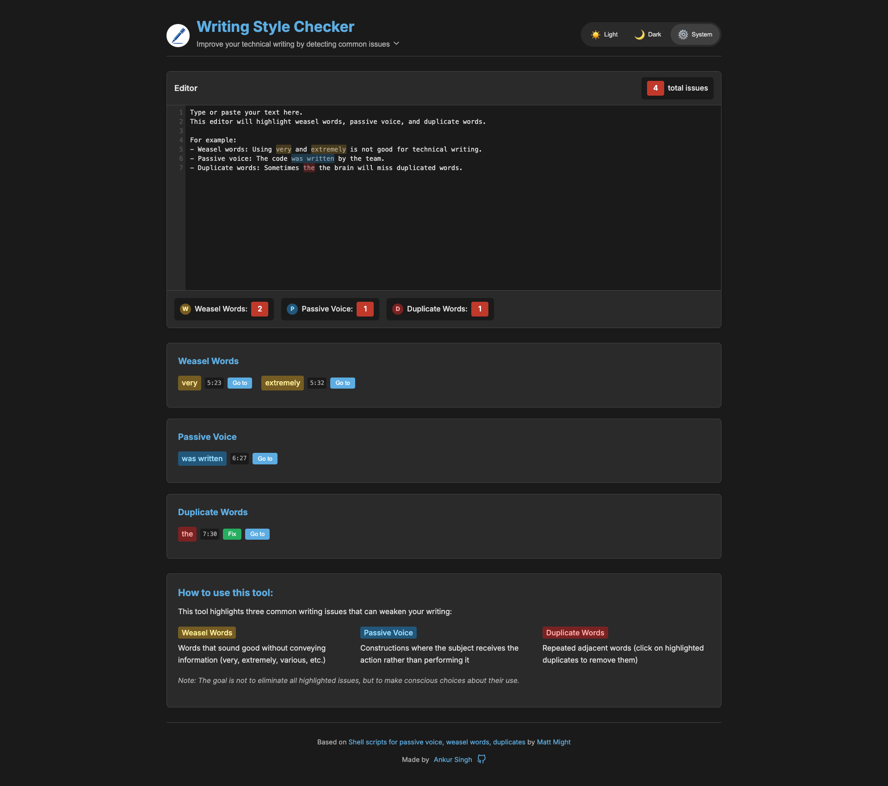

# Writing Style Checker

A browser-based tool that helps improve your writing by detecting and highlighting common stylistic issues. This tool analyzes text in real-time to identify:

- **Weasel Words**: Vague terms that add no value (e.g., "very", "extremely", "various")
- **Passive Voice**: Constructions where the subject receives rather than performs the action
- **Duplicate Words**: Accidentally repeated words that are often missed during proofreading

**[Live Demo: wsc.anks.in](https://wsc.anks.in)**



## 🔒 Privacy First

This application runs **entirely in your browser**. Your text is never transmitted to any server, stored in databases, or shared with third parties. All analysis happens locally in your browser using JavaScript.

## 🧠 Project Background

Inspired by [Matt Might's shell scripts for writing improvement](https://matt.might.net/articles/shell-scripts-for-passive-voice-weasel-words-duplicates/), this tool brings those command-line utilities to an interactive web interface. It was built in a single day using SvelteKit and Claude AI, demonstrating how AI-assisted development can quickly transform useful ideas into practical tools.

## 🔍 How It Works

### Detector Logic

The core functionality relies on three detection algorithms in `detector.ts`:

1. **Weasel Word Detection**:

   - Uses a predefined list of weasel words and phrases
   - Employs regular expressions with word boundaries (`\b`) to match whole words only
   - Returns matched words with their positions for highlighting

2. **Passive Voice Detection**:

   - Combines regular past participles (words ending in `-ed`) with irregular verb forms
   - Detects auxiliary verbs (am, is, are, was, were, etc.) followed by these participles
   - Identifies complete passive constructions for highlighting

3. **Duplicate Word Detection**:
   - Uses a regex pattern that finds adjacent identical words separated by whitespace
   - Handles case-insensitive matching to catch duplicates with different capitalization
   - Special handling for detecting duplicates across line breaks

The detector functions not only identify issues but also return precise character positions, enabling accurate highlighting and making targeted fixes possible.

### User Interface

The interface displays detected issues in three ways:

1. **Inline Highlighting**: Issues are highlighted directly in the text editor
2. **Issue Counts**: Summary statistics show the number of each issue type
3. **Issue Lists**: Detailed lists below the editor show each issue with position information

For duplicate words, a "Fix" button is provided to automatically remove them.

## 🗂️ Project Structure

```
.
├── src
│   ├── lib
│   │   ├── App.svelte        # Main application component
│   │   ├── detector.ts       # Core detection algorithms
│   ├── routes
│   │   ├── +layout.server.js # SSG configuration
│   │   └── +page.svelte      # Main page
│   └── styles
│       └── main.scss         # Global styles
├── data
│   └── words.js              # Word lists for detection
├── static
│   ├── images                # App images and screenshots
│   ├── favicon               # Favicon files
│   ├── robots.txt            # SEO configuration
│   └── sitemap.xml           # SEO configuration
├── wrangler.toml             # Cloudflare deployment config
└── svelte.config.js          # SvelteKit configuration
```

## 📊 Data Sources

The word lists used for detection come from:

- **Original Word Lists**: The core weasel words and irregular verbs are from [Matt Might's original blog post](https://matt.might.net/articles/shell-scripts-for-passive-voice-weasel-words-duplicates/)
- **Expanded Lists**: Additional words have been added with AI assistance to improve detection coverage

The complete lists are maintained in `data/words.js` and imported by the detector module.

## 🛠️ Setup Instructions

### Local Development

1. Clone the repository:

   ```bash
   git clone https://github.com/rush-skills/wsc.git
   cd wsc
   ```

2. Install dependencies:

   ```bash
   npm install
   ```

3. Run development server:

   ```bash
   npm run dev
   ```

4. Visit `http://localhost:5173` in your browser

### Deployment to Cloudflare Pages

This project is configured for deployment to Cloudflare Pages. To deploy your own instance:

1. **Update `wrangler.toml`**:

   - Replace the `account_id` with your Cloudflare account ID
   - Update the `route` under `[env.production]` to your custom domain (if applicable)

   ```toml
   # Example wrangler.toml changes
   account_id = "your-account-id-here"

   [env.production]
   route = "your-domain.com/*"  # Optional: only needed for custom domains
   ```

2. **Deploy using Wrangler CLI**:

   ```bash
   # Install Wrangler if you haven't already
   npm install -g wrangler

   # Login to your Cloudflare account
   wrangler login

   # Deploy to Cloudflare
   wrangler deploy
   ```

3. **Access your site**:
   - Your site will be available at `https://writing-style-checker.<your-account>.workers.dev`
   - If you configured a custom domain, it will also be available there once DNS propagates

That's it! The application is now deployed to your Cloudflare Workers account.

## 👥 Contributing

Contributions are welcome! Here are some ways you can help:

### Adding More Words to the Dataset

The word lists are stored in `data/words.js`. To add more words:

1. Fork the repository
2. Edit `data/words.js` to add:
   - New weasel words to the `additionalWeaselWords` array
   - New irregular verb forms to the `irregularVerbs` array
   - New auxiliary verbs to the `auxiliaryVerbs` array if needed
3. Submit a pull request with a brief explanation of why the words should be added

### Other Contributions

- Bug fixes
- UI improvements
- Performance optimizations
- Documentation improvements

For substantial changes, please open an issue first to discuss your ideas.

## 🙏 Acknowledgements

- [Matt Might](https://matt.might.net/) for the original shell scripts and concept
- Built with [SvelteKit](https://kit.svelte.dev/)
- Deployed on [Cloudflare Pages](https://pages.cloudflare.com/)
- Development assisted by Claude AI

## 📄 License

MIT License
